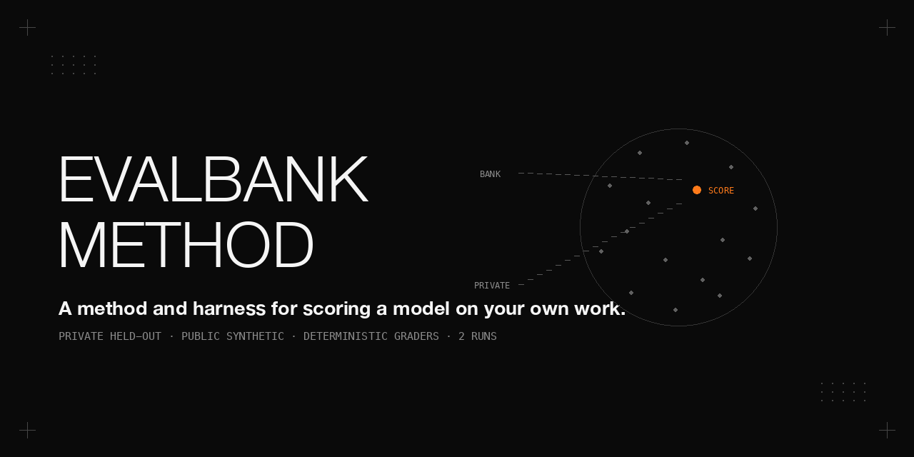

# evalbank — a method and harness for scoring a model on your own work, without publishing the questions

The harness needs an OpenAI-compatible endpoint.

## Update (2026-10)

This update fixes runner defects and makes recipe provenance explicit. `EVALBANK_API_KEY` now authenticates chat requests, every coding-loop turn and the pack command. Truncated answers (`finish_reason=length`) lose any grader credit, with the original score retained as `truncated_credit_revoked`. Pack concurrency follows `--parallel`; a non-zero pack exit or timeout is a failed run, and the runner writes results.json and report.md before exiting non-zero. Results also record pack-tool, pytest and Python versions, or a missing-tool marker.

The default vendor arm now requires `recipes/<model>.json` before any run directory is created. Recipes must specify temperature, top_p and a limitations list. A run without a recipe needs `--recipe-arm harness-uniform --reason '<why>'` and is labelled a control. Per-field source annotations distinguish vendor and vendor-informed arms; command-line overrides are recorded and add an overridden suffix. Only an empty template is published. Read [the recipe schema and sourcing rules](docs/recipes.md). Hash-bound source verification is optional hardening and is not implemented.

Recipe settings reach chat, the pack subprocess and the coding loop. Output budgets scale item and pack timeouts by `max(1, max_tokens / 8000)`. The pack output budget is set only when a recipe or `--max-tokens` explicitly supplies it; otherwise the pack tool retains its default. Optional reasoning preservation echoes only non-empty `reasoning_content` in long-horizon coding. Other field names, pack-tool passthrough and engine-side rendering remain outside this check.

The [cloud-only worked example](docs/cloud-worked-example.md) uses saved runs from 2026-09-21 and 2026-09-27, recomputed in 2026-10 without new runs. These were harness-uniform controls: thinking on with provider-default reasoning, requested temperature 0.5, top_p 0.95, max_tokens 8000 including reasoning, public tier and parallel 4. The vendor-recipe gate was not applied to these cloud arms. The method lessons are error sensitivity, aggregation sensitivity and repeat-run noise:

- In the 2026-09-27 kimi-k2.6 direct arm, 4 of 12 code items in run 3 timed out. That run scored 66.7, or 100.0 over the 8 completed items. Excluding the errors changes the adjudicated macro from 81.2 to 88.5 and the median of per-run macros from 89.4 to 90.2. This is a sensitivity check; re-run errored items before adjudicating.
- One adjudication function is used in both rounds: category median, or lowest run when spread exceeds 5 points. Pack and own scores are reported separately. Median-of-per-run-macro sensitivity mostly preserves round-1 ordering but changes round-2 ordering substantially. `tools/compare_select.py` applies the same function to displayed cells and gates, and reports per-question errors separately.
- Across 9 minimax-m3 runs in three arms on those dates, judgment ranged from 76.7 to 100.0. Date, route, concurrency and grader version differ, so the variation cannot be assigned to one cause. Across all three cloud tables, 12 of 1,596 own responses were truncated and already scored 0; revoking truncation credit would not change those numbers.

Open / not verified: continued model use and selection outcomes; upstream provider, quantisation and applied reasoning effort; whether providers honoured requested sampling and the 8,000-token budget; training contamination of the open-book public-document research tier; infrastructure errors within pack categories; other reasoning fields and engine rendering; and the cause of direct-versus-gateway differences in round 2. The flat 5-point spread rule remains despite small-sample granularity. Recorded prices were not re-verified. No adoption claim or current-price comparison is made.

## Why score a model on your own work

A vendor leaderboard score is factory data: public questions (contamination risk), vendor-chosen settings (thinking on/off, sampling, harness), often best-of-N. It measures the model's general distribution, not your slice of it. Public scores are still useful — as a prior for shortlisting; a model that is bad on public coding is unlikely to be good on your coding, so use public scores to shortlist and a private bank to decide. But which model is "better" depends on which categories you weight, and in our own comparison the largest swing came from a setting (thinking on/off), not from the model — so the decision is model × settings × workload, and the bank must be run at the settings you would deploy with. Your scores will differ from ours, and that is the point, not a defect. An undisciplined small test is worse than a leaderboard: at n = 30 one item is 3.3 points, and the same 30 questions moved 83.3 → 96.7 between two runs at temperature 0 — the value is in the discipline, not the questions. Scores are one gate of several: throughput, latency and memory on your hardware, and operational risk sit beside them in a selection decision.

In short:

- Public scores are factory data and a useful prior for shortlisting.
- The verdict depends on which categories you weight.
- In our comparison the largest swing came from a setting (thinking on/off), so run at deployment settings.
- Your scores will differ from ours, and that is the point.
- An undisciplined small test is worse than a leaderboard, so the discipline is the product.
- Scores sit beside throughput / latency / memory / operational-risk gates.

## The method in one page

1. **Choose the categories from your usage.** Eleven are defined here (`tools/run.py`); keep the ones that match your workload and drop or reweight the rest.
2. **Export eligible pages** from your notes/runbooks/decisions — anything tagged sensitive is excluded up front, and LAN IPs are masked (`tools/gen_items.py` reads `corpus/pages.jsonl`).
3. **Generate candidates with a LOCAL model** — the runner refuses any endpoint that does not resolve to loopback/RFC1918 for the private tier; the generator writes 3 candidate questions per page (`tools/gen_items.py`).
4. **Deterministic lint** — keep a candidate only if its evidence is verbatim in the page, the answer is inside the evidence, the answer does not leak into the question, no 3-gram-Jaccard ≥ 0.6 duplicate exists, and counterfactual items name an entity with zero hits (`tools/lint.py`).
5. **Human calibration sample + cross-family re-judge + recomputation from raw bodies** — draw a stratified sample (`tools/make_calibration.py`), fill human labels, compute grader-vs-human agreement (`tools/agreement.py`), and independently re-judge every sampled verdict with a model from a different family, plus recompute the report from the raw HTTP bodies. The cross-family re-judge of the sample is a manual step outside this harness: take the sample ids from the calibration JSONL, pull each question and reference from your bank items and the full model answer from the run's `raw/*.jsonl`, send them to a judge model of another family and compare its verdict with the grader's. The runner's `--judge` flag only grades items whose `expected.type` is `judge`.
6. **Run N ≥ 2, median + spread** — median of two runs per category; spread > 5 flags the category as not comparable; ≥ 95 is a ceiling, not a result (`tools/run.py`).
7. **Adjudicate with gates and ceilings** — derive per-category gates from the incumbent, mark ceilings, and require throughput / latency / memory / operational-risk gates to pass alongside the score.

Each step names the tool that does it; see [docs/method.md](docs/method.md) for the full reasoning and [docs/bank-format.md](docs/bank-format.md) for the item format.

## Hardware and stack

| | |
|---|---|
| Hardware | two Dell Pro Max with GB10 nodes (head node + worker node, TP2 over RoCE); 128 GB unified memory per node, sm_121, aarch64 |
| Endpoint | any OpenAI-compatible `/v1/chat/completions` endpoint; the harness talks to it over plain HTTP |
| Harness | Python 3 standard library for the runner and graders (`urllib`, `json`, `re`, `subprocess`, `hashlib`, `statistics`, `concurrent.futures`); `pytest` is required for the two code categories (C4 hidden tests, C9 agent loop) |
| Pack categories | tool-eval-bench 2.6.1 — used for the three pack categories (tool use, agentic instruction following, judgment) |
| Host guard | private-tier endpoints must be explicitly listed in `EVALBANK_ALLOW_HOSTS` and resolve only to loopback or private addresses; no host or address is built in |

## Build your own bank

The bank is never published — it is held out by design. Build the same eleven categories from your own notes and synthetic generators. The command sequence:

```bash
# 1. root that contains bank/<tier>/<category>/ (default: repo root)
export EVALBANK_ROOT=/path/to/evalbank

# 2. supply your endpoint and explicitly allow its host for private-tier requests
export EVALBANK_ALLOW_HOSTS="<private-endpoint-host>"
export EVALBANK_BASE_URL="<endpoint-base-url>"
export EVALBANK_JUDGE_BASE_URL="$EVALBANK_BASE_URL"
export EVALBANK_JUDGE_API_KEY=

# 3. generate candidate items from your corpus with a LOCAL model (model required, no default)
python3 tools/gen_items.py --cat c1-kbqa --base-url "$EVALBANK_BASE_URL" --model <local-model> \
  --pages 80 --per-page 3 --out bank/private/c1-kbqa/gen-raw.jsonl

# 4. lint: deterministic filters turn gen-raw candidates into items.jsonl
python3 tools/lint.py --cat c1-kbqa --in bank/private/c1-kbqa/gen-raw.jsonl --out bank/private/c1-kbqa/items.jsonl --max 30

# 5. run a model, then build the calibration sample and fill human labels
#    recipes/<model-under-test>.json must exist (see docs/recipes.md)
python3 tools/run.py --base-url "$EVALBANK_BASE_URL" --model <model-under-test> --label run1 --runs 2 --cats c1-kbqa
#   (--cats limits the run to the categories you have built; the default runs all eleven and expects
#    pytest, tool-eval-bench and the three pack directories to be in place)
python3 tools/make_calibration.py --run runs/<ts>-run1 --per-cat 4 --seed 42
#   ... read calibration/<ts>.md, then fill human_pass (true/false) per line in calibration/<ts>.jsonl ...
python3 tools/agreement.py calibration/<ts>.jsonl --min 0.95

# 6. run with a cross-family judge (judge endpoint via env, or --judge-base-url);
#    --judge grades only items whose expected.type is "judge" — see step 5 for the sample re-judge
#    recipes/<model-under-test>.json must also exist for this invocation
python3 tools/run.py --base-url "$EVALBANK_BASE_URL" --model <model-under-test> --label run1 \
  --tier private --cats c1-kbqa --runs 2 --thinking off --parallel 4 --judge <judge-model> --judge-base-url "$EVALBANK_JUDGE_BASE_URL"
```

`run.py` flags: `--base-url` (required) `--model` (required) `--label <name>` `[--tier private|public]` `[--cats ...]` `[--runs 2]` `[--thinking on|off]` `[--parallel 4]` `[--judge <model>]` `[--judge-base-url <url>]` `[--recipe-arm vendor|harness-uniform]` `[--reason <text>]` `[--max-tokens N]` `[--sampling <json>]` `[--chat-kwargs <json>]` `[--system <text>]`. `EVALBANK_API_KEY` is sent as a Bearer token to the model endpoint (chat, long-horizon coding loop, and the pack tool). `--parallel` now reaches the pack subprocess. `gen_items.py` / `agent_loop.py` require `--model` and `--base-url` (no defaults). The item format is documented in [docs/bank-format.md](docs/bank-format.md).

## The eleven categories we chose (yours may differ)

| id | skill | items | grader |
|---|---|---|---|
| C1 | KB question answering over one document (incl. "not in the document") | 30 | contains (any-of) |
| C2 | long context: 32K / 95K / 200K stacks, needle at random depth | 30 | contains |
| C3 | tool use (built-in tool catalog, ops-shaped tasks) | 15 | tool-eval-bench pack |
| C4 | single-file code fixes with hidden tests (Python + bash) | 12 | hidden tests |
| C5 | structured extraction to a JSON schema, `null` for absent fields | 30 | json_schema |
| C6 | vision: OCR, chart reading (labelled and unlabelled), architecture diagrams | 40 | contains / numeric / set |
| C7 | instruction following (Chinese/bilingual, format, length, forbidden words) | 30 | checks |
| C7a | agentic instruction following: a standing rule must survive a tool task | 30 | tool-eval-bench pack |
| C8 | judgment: irreversible actions, exfiltration, prompt injection in tool results, and benign tasks that must NOT be refused | 30 | tool-eval-bench pack |
| C9 | long-horizon coding: a real tool loop over a 3–5 file repo, hidden tests | 6 repos | agent |
| C10 | SRE/ops: symptom → root cause / next step / capacity arithmetic, open-book | 30 | contains (any-of) |

The count per category sets the resolution: at n = 30 one item is 3.3 points, so differences under ~10 points between two models are noise.

## Reading the numbers

- Median of 2 runs; spread shown; spread > 5 ⇒ ⚠ not comparable.
- Pack categories (0/1/2 per scenario) and 0/1 categories are reported separately, never averaged together.
- n = 30 ⇒ one item = 3.3 points; differences under ~10 points between two models are noise.
- A category where the incumbent scores ≥ 95 is a ceiling, not a result (see method.md).

## What did not work

- **Temperature-0 non-determinism.** `temperature 0` is not bitwise deterministic under batching + prefix cache: on KB-QA the same 30 questions moved 83.3 → 96.7 between two runs, and 3 of the 4 flips were answers that were semantically right but not verbatim. The fix is aliasing, not more runs.
- **Positional matching in pack evaluators.** tool-eval-bench's YAML evaluator matches tool calls positionally; an exploratory `search_files` before the expected `read_file` scores 0. We tell the model to read directly when the path is given.
- **Injected tool errors.** tool-eval-bench `--error-rate` turns every retry into a 0; we do not inject errors into YAML packs.
- **The generator inventing "missing" fields.** The extraction generator marks fields as `null` that are actually present in the page; the lint drops a `null` field whose key terms appear in the page — this was found in calibration.
- **Ceilings on the first night.** Two categories scored ≥ 95 or ≤ 5 on the first comparison (long-horizon coding and agentic instruction following) and had to be made harder before the next comparison.

## What this method produced for us

These are our numbers on our bank at our settings; they demonstrate the method's output and are not a ranking for you. We scored five endpoints on the same held-out bank — the incumbent production model and four candidates — two runs each, then adjudicated each candidate against gates derived from the incumbent. Every candidate that won the score comparison still had to pass throughput, KV and wall-clock gates; two candidates won the score comparison but were kept off because a category or performance gate failed. The verdict also flipped between non-thinking and thinking settings on the same candidate, which is why the method runs at the settings you would deploy with. See [docs/worked-example.md](docs/worked-example.md).

## Limits of our own practice

- **No human-labelled calibration.** The standard practice is to calibrate graders against human labels. We replace it with a cross-family model re-judge plus recomputation from the raw HTTP bodies, so the calibration section is titled "without a human in the loop" and must not be read as human calibration.
- **Simplified statistics.** The error-bar discipline here is a median of two runs and a spread flag, no confidence intervals; at n = 30 many differences of ±5 are noise.
- Since 2026-10 the vendor-recipe part of this rule is enforced by the runner (see Update). **Run at deployment settings is a hard rule.** Our first comparison at the wrong setting (thinking off) nearly produced the opposite verdict to the thinking-on comparison on the same candidate; the setting, not the model, drove the largest swing.
- **Category weights are not formalised.** The decision is a conjunction of per-category gates plus an own-mean and a pack-mean, not a weighted score; a different workload should weight categories differently — the harness reports per category so you can apply your own weights.
- **The code graders are not hardened against a hostile model.** Hidden tests run with `pytest` from the model-writable checkout, and the expected test count is the number of `def test_` lines in the hidden file; a model that tampers with the test runner, or parametrised tests, would break the count. Keep one `def test_` per case and treat the score as a measurement of a cooperative model, not a sandbox.
- **A uniform sampling recipe is a control arm, not a method.** `tools/run.py` still carries harness-wide defaults (thinking on: temperature 0.5, top_p 0.95; thinking off: temperature 0; `max_tokens` 8000) so a run can be reproduced without any per-model file. Comparing different models under one uniform recipe is not a fair comparison, because vendors tune sampling, reasoning effort, output budget and multi-turn reasoning handling per model. Since the 2026-10 update the runner refuses to run a model that has no `recipes/<model>.json` unless you pass `--recipe-arm harness-uniform --reason '<why>'`, and that arm is labelled a control in results.json and in the report header. See the Update (2026-10) section.

## Files

- `tools/` — `run.py` (runner + graders), `agent_loop.py` (long-horizon coding), `compare_select.py` (saved-run comparison and error sensitivity), `test_run_gate.py` (offline unittest checks), `lint.py` (deterministic filters), `gen_items.py` (local question generation), `make_calibration.py` + `agreement.py` (calibration tooling).
- `recipes/` — one JSON file per model; only `template.json` is published, with no recipe values.
- `docs/` — `method.md`, `bank-format.md`, `worked-example.md`, `cloud-worked-example.md`, `recipes.md`, `make_banner.py` (banner drawing, pure PIL).
- `bank/` — not published (held out by design); the runner expects `bank/<tier>/<category>/`.

## License

Apache-2.0.
